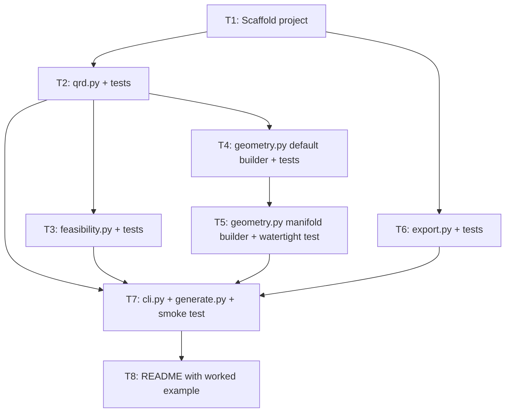

# Plan: Parametric 2D Skyline QRD Diffuser Generator

## Goal
Generate a 3D-printable 2D skyline QRD acoustic diffuser as an STL/3MF file from configurable design parameters. The mesh is built as a manifold heightfield so it is watertight by construction.

## Stack
- Python 3.10+
- `numpy` — QRD math and height map
- `trimesh` — 3D geometry construction and STL/3MF export
- `pytest` — unit tests

---

## Project Structure
```
diffuser_gen/
├── diffuser_gen/
│   ├── __init__.py
│   ├── qrd.py           # QRD sequence and height map logic
│   ├── geometry.py      # heightfield mesh construction via trimesh
│   ├── feasibility.py   # acoustic + print sanity checks and summary
│   ├── export.py        # STL/3MF export
│   └── cli.py           # argparse + entrypoint logic (importable)
├── tests/
│   ├── test_qrd.py
│   ├── test_geometry.py
│   └── test_feasibility.py
├── generate.py          # thin wrapper: `from diffuser_gen.cli import main; main()`
├── pyproject.toml
└── README.md
```

Notes:
- `qrd.py` (not `math.py`) to avoid shadowing the stdlib `math` module.
- `cli.py` lives inside the package so it is importable for tests.

---

## Module Specs

### `diffuser_gen/qrd.py`

Convention: indices run `n = 0..p-1`. `s_0 = 0` (no well at that cell).

**`qrd_sequence(p: int) -> np.ndarray`**
- Validate `p` is prime (raise `ValueError` otherwise).
- Return `np.array([(n*n) % p for n in range(p)], dtype=int)`.
- Example: `qrd_sequence(7)` → `array([0, 1, 4, 2, 2, 4, 1])`.

**`well_depths_mm(sequence: np.ndarray, f_design_hz: float, c_m_s: float) -> np.ndarray`**
- `p = len(sequence)`
- `unit_mm = (c_m_s / (2 * p * f_design_hz)) * 1000.0`
- Return `sequence * unit_mm`.

**`height_map_2d(p_x, p_y, f_design_hz, c_m_s, min_col_height_mm, combine="add") -> np.ndarray`**
- `seq_x = qrd_sequence(p_x)`, `seq_y = qrd_sequence(p_y)`
- `depths_x = well_depths_mm(seq_x, f_design_hz, c_m_s)`, likewise `depths_y`
- If `combine == "add"`:
  - `total_depth[i,j] = depths_x[i] + depths_y[j]`
  - `max_total = total_depth.max()`
  - `H[i,j] = (max_total - total_depth[i,j]) + min_col_height_mm`
- If `combine == "multiply"`:
  - Normalize each axis to `[0, 1]`, then `H[i,j] = (1 - dx_norm[i] * dy_norm[j]) * max_depth_mm + min_col_height_mm`
  - `max_depth_mm = max(depths_x.max(), depths_y.max())`
- Return `np.ndarray` of shape `(p_x, p_y)`, all values `>= min_col_height_mm`.

Reasoning: a deep well = a short column. The additive form doubles the max panel thickness vs. 1D (call this out in the summary).

---

### `diffuser_gen/geometry.py`

**`build_diffuser(params: dict) -> trimesh.Trimesh`**

Parameters:
```python
{
    "p_x": 7,
    "p_y": 7,
    "f_design_hz": 1000.0,
    "c_m_s": 343.0,
    "cell_size_mm": 30.0,       # outer dimension of each cell (column + wall)
    "wall_thickness_mm": 2.5,   # gap between adjacent columns
    "base_thickness_mm": 6.0,
    "min_col_height_mm": 5.0,
    "combine": "add",           # "add" or "multiply"
}
```

**Construction strategy: manifold heightfield, not column soup.**

We build a single watertight mesh by extruding a per-cell heightmap. Each cell `(i, j)` is a rectangular prism whose top face is at `base_thickness_mm + H[i,j]` and whose footprint is `col_size × col_size`, with `wall_thickness_mm / 2` margin on each side of the cell so adjacent columns have a `wall_thickness_mm` gap.

Algorithm:
1. Validate params (delegated to `feasibility.validate(params)`).
2. Compute `H = qrd.height_map_2d(...)`.
3. `col_size = cell_size_mm - wall_thickness_mm`.
4. Build base plate: `trimesh.creation.box(extents=(p_x * cell_size_mm, p_y * cell_size_mm, base_thickness_mm))`, translated so its bottom is at `z=0` and its `(0, 0)` corner is at `(0, 0)`.
5. For each `(i, j)`:
   - Extents: `(col_size, col_size, H[i, j])`
   - Center position: `(x, y, z)` where
     - `x = (i + 0.5) * cell_size_mm`
     - `y = (j + 0.5) * cell_size_mm`
     - `z = base_thickness_mm + H[i, j] / 2`
   - Append to a list of column meshes.
6. Concatenate base + columns via `trimesh.util.concatenate()`.
7. Run `mesh.process()` (trimesh 4.x; equivalent to merge-vertices + dedup in one call). Slicers for FDM accept this output; the watertight test (see below) is a best-effort assertion, not a hard requirement.

If you need a strictly manifold mesh (e.g. for resin printing or boolean ops downstream), provide an opt-in path:

**`build_diffuser_manifold(params: dict) -> trimesh.Trimesh`** — same inputs, but constructs a single watertight mesh from the heightmap directly:
- Bottom face: two triangles spanning the panel footprint at `z=0`.
- Top face: triangulated heightmap where cell interiors are flat at `H[i,j] + base_thickness_mm` and gaps between columns drop down to `z = base_thickness_mm` (a "moat" between cells).
- Side walls: vertical quads (two triangles each) along the outer perimeter.
This is the version that should pass `is_watertight`. Wire it behind a `--manifold` CLI flag.

Default path uses the simpler concatenated version since slicers handle it.

---

### `diffuser_gen/feasibility.py`

**`validate(params: dict) -> None`** — raise `ValueError` on:
- `p_x` or `p_y` not prime
- `f_design_hz <= 0`, `c_m_s <= 0`
- `wall_thickness_mm >= cell_size_mm`
- `min_col_height_mm < 0`
- `base_thickness_mm <= 0`

**`summary(params: dict, height_map: np.ndarray) -> dict`** returns:
- `panel_w_mm`, `panel_d_mm`, `total_height_mm`
- `max_well_depth_mm` (== `H.max() - min_col_height_mm`)
- `f_design_hz` (echo, lower bound)
- `f_high_hz = c_m_s / (2 * (cell_size_mm - wall_thickness_mm) * 1e-3)` — well-width upper cutoff
- `col_size_mm`
- Warnings (list of strings):
  - `H.max() > 150` → "tall columns may be fragile"
  - `col_size_mm < 8` → "well width below typical FDM nozzle resolution"
  - `cell_size_mm > 0.5 * wavelength_at_f_design` → "cells too large for design freq"

**`print_summary(summary: dict) -> None`** — pretty-print to stdout, including the upper cutoff frequency and any warnings.

---

### `diffuser_gen/export.py`

**`export(mesh: trimesh.Trimesh, output: str, fmt: str) -> str`**
- Strip any existing `.stl` / `.3mf` suffix from `output`, then append based on `fmt`.
- `fmt == "stl"` → binary STL.
- `fmt == "3mf"` → 3MF (requires `lxml`).
- Return the final path written.

---

### `diffuser_gen/cli.py`

`argparse` flags:

| Flag | Default | Description |
|---|---|---|
| `--p-x` | 7 | QRD prime, x-axis |
| `--p-y` | 7 | QRD prime, y-axis |
| `--f-design` | 1000.0 | Design (lower-bound) frequency, Hz |
| `--c` | 343.0 | Speed of sound, m/s |
| `--cell-size` | 30.0 | Cell size, mm |
| `--wall-thickness` | 2.5 | Wall/gap thickness, mm |
| `--base-thickness` | 6.0 | Base plate thickness, mm |
| `--min-col-height` | 5.0 | Minimum column height, mm |
| `--combine` | `add` | Combination mode: `add` or `multiply` |
| `--manifold` | flag | Use single watertight heightfield builder |
| `--format` | `stl` | Output format: `stl` or `3mf` |
| `--output` | `diffuser` | Output filename (extension stripped/replaced) |
| `--preview` | flag | Call `mesh.show()` instead of (or before) export |

Flow:
1. Parse args → params dict.
2. `feasibility.validate(params)`.
3. Build height map, then mesh.
4. `feasibility.summary(...)` → `feasibility.print_summary(...)`.
5. If `--preview`: open viewer.
6. `export.export(mesh, output, fmt)` → print final path.

`generate.py` at repo root is a one-liner: `from diffuser_gen.cli import main; main()`.

---

### `tests/test_qrd.py`

- `test_qrd_sequence_p7`: `qrd_sequence(7).tolist() == [0, 1, 4, 2, 2, 4, 1]`
- `test_qrd_sequence_p11_range`: length 11, all values in `[0, 10]`
- `test_qrd_rejects_nonprime`: raises `ValueError` for `p in (1, 4, 6, 9)`
- `test_well_depths_scaling`: doubling `f_design_hz` halves max depth
- `test_height_map_shape`: shape is `(p_x, p_y)`
- `test_height_map_min`: `H.min() == min_col_height_mm` (approx)
- `test_height_map_combine_modes`: `add` and `multiply` both produce valid shapes; `add` max ≈ `2 * 1D max`

### `tests/test_geometry.py`

- `test_build_diffuser_returns_mesh`: returns `trimesh.Trimesh`
- `test_panel_extents`: `mesh.bounding_box.extents[:2] == (p_x * cell, p_y * cell)` (within float tolerance)
- `test_panel_height`: `bbox.extents[2] == base_thickness + H.max()` (within tolerance)
- `test_volume_floor`: `mesh.volume >= base_thickness * panel_area + min_col_height * col_area * p_x * p_y`
- `test_manifold_builder_is_watertight`: `build_diffuser_manifold(...).is_watertight` is True
- (No vertex-count assertion — too brittle across construction changes.)

### `tests/test_feasibility.py`

- `test_validate_rejects_nonprime_p`
- `test_validate_rejects_wall_thicker_than_cell`
- `test_summary_includes_f_high`
- `test_summary_warns_on_small_well_width`

---

## `pyproject.toml`
```toml
[project]
name = "diffuser-gen"
version = "0.1.0"
requires-python = ">=3.10"
dependencies = [
    "numpy",
    "trimesh",
]

[project.optional-dependencies]
dev = ["pytest"]
3mf = ["lxml"]
preview = ["pyglet<2"]

[project.scripts]
diffuser-gen = "diffuser_gen.cli:main"

[build-system]
requires = ["setuptools>=64"]
build-backend = "setuptools.build_meta"

[tool.setuptools.packages.find]
include = ["diffuser_gen*"]
```

---

## README.md (outline)

- One-paragraph description and a photo/screenshot slot.
- Quickstart: `pip install -e .[dev,3mf]`, then `python generate.py --p-x 7 --p-y 7 --f-design 1000 --output panel`.
- Example invocation with expected console summary (panel dims, `f_design`, `f_high`, warnings).
- "How it works" with the QRD formula and the additive 2D combination.
- Printing notes: orientation, supports, infill.

---

## Implementation Notes

- **Acoustic context to surface in summary:** A QRD designed for `f_design` diffuses well in the band roughly `[f_design, c / (2·w)]` where `w` is well width (`cell_size - wall_thickness`). Both endpoints belong in the printed summary so users don't misuse the panel.
- **2D additive depth doubles panel thickness** vs. a 1D QRD with the same prime. `--combine multiply` keeps total depth bounded to `max(depths_x, depths_y)` at the cost of a less acoustically-justified pattern; treat it as experimental.
- **Default builder is the simple concatenated one** because slicers tolerate it and it is fast. `--manifold` is for users who need a clean mesh (resin slicers, boolean ops, FEA).
- **Print feasibility warnings are advisory.** They print but do not block export. A user designing for 200 Hz will get a tall panel and should be told, not stopped.
- **Periodicity caveat (not v1):** A single QRD panel is periodic, which produces grating lobes. Modulated/aperiodic arrays of multiple primes diffuse more uniformly. Mention in README as a "future work" item.

---

## Implementation Tasks

Each task is sized for a single agent. Tasks specify their inputs, outputs, dependencies, and acceptance criteria so they can be dispatched independently and verified in isolation.

### Dependency graph



Plain-text DAG (same graph, for non-Mermaid readers):

```
T1 ──┬──> T2 ──┬──> T3 ──────────────────────┐
     │        ├──> T4 ──> T5 ────────────────┤
     │        └────────────────────────────► T7 ──> T8
     └──> T6 ───────────────────────────────►┘
```

### Execution batches (max parallelism)

| Batch | Tasks (parallel) | Unblocks |
|---|---|---|
| 1 | T1 | T2, T6 |
| 2 | T2, T6 | T3, T4, T7-pending |
| 3 | T3, T4 | T5, T7-pending |
| 4 | T5 | T7 |
| 5 | T7 | T8 |
| 6 | T8 | — |

Critical path: T1 → T2 → T4 → T5 → T7 → T8 (6 sequential tasks).

### Task specs

Every task must end green: `pip install -e .[dev]` succeeds, and `pytest -q` passes for the tests it owns. Agents should not modify files outside their declared outputs.

---

**T1 — Scaffold project**
- Depends on: —
- Outputs:
  - `pyproject.toml` (exact contents from the spec above)
  - `diffuser_gen/__init__.py` (empty)
  - `tests/__init__.py` (empty)
  - `tests/conftest.py` (empty placeholder, ok to omit if unused)
  - `.gitignore` covering `__pycache__/`, `*.egg-info/`, `dist/`, `build/`, `*.stl`, `*.3mf`
- Acceptance:
  - `pip install -e .[dev]` succeeds in a clean venv.
  - `python -c "import diffuser_gen"` succeeds.
  - `pytest -q` runs (collecting zero tests is fine).

---

**T2 — `qrd.py` + tests**
- Depends on: T1
- Outputs:
  - `diffuser_gen/qrd.py` implementing `qrd_sequence`, `well_depths_mm`, `height_map_2d` per the spec
  - `tests/test_qrd.py` with all six test cases listed under "tests/test_qrd.py"
- Acceptance:
  - `pytest tests/test_qrd.py -q` passes.
  - `qrd_sequence` raises `ValueError` for `p in {1, 4, 6, 9}`.
  - No imports from `diffuser_gen.geometry`, `feasibility`, `cli`, or `export`.

---

**T3 — `feasibility.py` + tests**
- Depends on: T2
- Outputs:
  - `diffuser_gen/feasibility.py` implementing `validate`, `summary`, `print_summary`
  - `tests/test_feasibility.py` with the four test cases listed
- Acceptance:
  - `pytest tests/test_feasibility.py -q` passes.
  - `summary()` includes keys: `panel_w_mm`, `panel_d_mm`, `total_height_mm`, `max_well_depth_mm`, `f_design_hz`, `f_high_hz`, `col_size_mm`, `warnings`.
  - `validate()` raises `ValueError` (not `AssertionError`) on each invalid input.

---

**T4 — `geometry.py` default builder + tests**
- Depends on: T2
- Outputs:
  - `diffuser_gen/geometry.py` containing only `build_diffuser(params: dict)` for the concatenated-column path
  - `tests/test_geometry.py` containing: `test_build_diffuser_returns_mesh`, `test_panel_extents`, `test_panel_height`, `test_volume_floor`
- Acceptance:
  - `pytest tests/test_geometry.py -q` passes (manifold test added in T5).
  - Column centers are at `((i + 0.5) * cell, (j + 0.5) * cell, base + H[i,j]/2)`; verify with at least one explicit position assertion.
  - No CLI, no file I/O.

---

**T5 — Manifold builder + watertight test**
- Depends on: T4
- Outputs:
  - Extend `diffuser_gen/geometry.py` with `build_diffuser_manifold(params: dict)`
  - Extend `tests/test_geometry.py` with `test_manifold_builder_is_watertight`
- Acceptance:
  - `build_diffuser_manifold(default_params).is_watertight` is `True` for at least `p_x=p_y=7`.
  - `pytest tests/test_geometry.py -q` passes (all tests, including from T4).
  - Does not modify `build_diffuser` from T4.

---

**T6 — `export.py` + tests**
- Depends on: T1
- Outputs:
  - `diffuser_gen/export.py` implementing `export(mesh, output, fmt)` per spec
  - `tests/test_export.py` covering: extension stripping (e.g. `"panel.stl"` + `fmt="3mf"` → `panel.3mf`), STL round-trip via `trimesh.load`, error on unknown `fmt`
- Acceptance:
  - `pytest tests/test_export.py -q` passes.
  - Uses a `tmp_path` fixture; writes no files outside it.
  - Can be tested with a trivial `trimesh.creation.box()` mesh — no dependency on T2/T4.

---

**T7 — `cli.py` + `generate.py` + smoke test**
- Depends on: T2, T3, T5, T6
- Outputs:
  - `diffuser_gen/cli.py` with `main(argv: list[str] | None = None)` per the CLI spec
  - `generate.py` (one-liner: `from diffuser_gen.cli import main; main()`)
  - `tests/test_cli.py` with an end-to-end smoke test: invoke `main(["--p-x", "5", "--p-y", "5", "--output", str(tmp_path / "panel")])` and assert the `.stl` file exists and is non-empty
- Acceptance:
  - `pytest tests/test_cli.py -q` passes.
  - `python generate.py --help` prints all flags from the spec.
  - `python generate.py --p-x 7 --p-y 7 --output /tmp/diffuser` (or Windows equivalent) writes a valid STL and prints a summary including `f_design` and `f_high`.
  - `--manifold` flag routes to `build_diffuser_manifold`.

---

**T8 — README with worked example**
- Depends on: T7
- Outputs:
  - `README.md` matching the outline above
- Acceptance:
  - Quickstart commands run as written.
  - The example invocation matches actual CLI output (capture and paste, don't paraphrase).
  - No instructions reference flags or modules that don't exist.

### Agent dispatch notes

- **Each task is self-contained.** The spec sections above are the source of truth; agents should not need to invent APIs.
- **File ownership is exclusive.** Only T5 may edit `geometry.py` after T4 lands; only T7 creates `cli.py`. If two tasks need to touch the same file, sequence them — do not parallelize.
- **Reject scope creep.** If an agent finishes its task and notices something unrelated to fix, it should flag it as a follow-up, not edit other modules.
- **Acceptance is binary.** A task is done when its acceptance criteria pass on a clean checkout; otherwise it is in progress.
